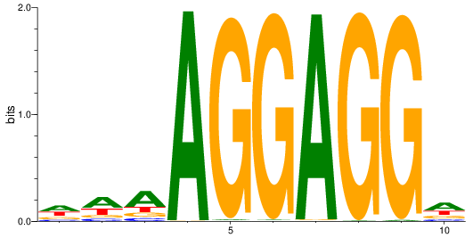

```{r setup, include=FALSE}
knitr::opts_chunk$set(echo=TRUE)
library('reticulate')
reticulate::use_condaenv(condaenv = "r-reticulate")
```

---

# Gibbs sampling

---
## Imports

We used numpy, math and random for the main part of the problem, and seq_logo for looking at and comparing results.

```{r, install_seqlogo}
reticulate::conda_install(
  envname = "r-reticulate", 
  packages=c("seqlogo", "pdf2svg", "setuptools"),
  channel=c("bioconda", "conda-forge"), 
  conda="auto", 
  additionall_install_args="--solver=libmamba"
)
```

```{python LoadPackages}
import numpy as np
import random
import math
import seqlogo

#import function for building sequence motif & idenfitying seqs matching to motif
from data_readers import *
from seq_ops import get_seq
from motif_ops import *
```

---
## Implement Gibbs Sampler

Information from problem assignment:

Gibbs sampling is a MCMC approach to identify enrichments. Here we will implement a method to identify motifs from a set of regions. 

Important considerations:
- We will need to score each sequence with a PWM using the `score_kmer()` or `score_sequence()` functions
  - You will need to investigate into the help documenation and libraries to identify how best to use these functions. 
- These sites are often not strand-specific and so both scores on the negative as well as positive strand should be considered
- To select a random sequence, use `random.randint()` or `numpy.random.randint()`
- To select a new position $m$ (as defined below) use `random.choices()` or `numpy.random.choice()`  

Assumptions: 
- We know $k$ as the length of expected motif
- Each sequence contains the motif we are looking for

Probability of chosing position $m$ = \frac{A_{m}}{\sum_{l}A_{l}}$ for positions $l$ in DNAi

**Note:** I have also added a function to `motif_ops.py` that will calculate the information content of your motifs. This is useful to observe the progression of your Gibbs sampler as well as a measure of convergence. You can use this function as `IC = pfm_ic(pfm)`. You should expect a slow increase of IC until it plateaus such as in the plot below from your lecture slides:   

```{python Driver}
# Here we test your Gibbs sampler.
# You do not need to edit this or the section below. This is the Driver program

#read promoters, store in a list of strings
seq_file="data/GCF_000009045.1_ASM904v1_genomic.fna"
gff_file="data/GCF_000009045.1_ASM904v1_genomic.gff"

seqs = []

for name, seq in get_fasta(seq_file): # For each entry in our FASTA file
    for gff_entry in get_gff(gff_file): # For each entry in our GFF file
        if gff_entry.type == 'CDS': # If this is a coding sequence
            promoter_seq = get_seq(seq, gff_entry.start, gff_entry.end, gff_entry.strand, 50) # Extract 50 bp as a promoter             #'''
            #Because the gibbs sampling assumption is broken in just using promoters,
            #and because it takes very long time to randomly progress through so many
            #regions, for this example we will pre-filter for sequences that all contain
            #part of the shine-dalgarno motif:
            #'''
            if "AGGAGG" in promoter_seq:
                seqs.append(promoter_seq)
```

```{python support_functions}
def create_possible_motif(sequence, k=10):
    """
    Create a k-length motif from a larger sequence, using random selection
      
    Args:
      sequence (string):   single sequence to find a random motif in
      k (int):            length of proposed motif
        
    Returns:
      string of length k: containing motif 
    """
          
          
    N = random.randint(0, len(sequence)-k)
    return (sequence[N:N+k])


def fuzzy_diff(x, y, epsilon):
    """
    Compares x and y within epsilon difference, and returns true or false
  
    Args:
      x,y (floats):  values to be compared, are they within epislon of each other if so function returns TRUE, otherwise, returns FALSE
    epsilon (float) - the amount of difference, or tolerance between X & Y that we will allow
    
    Returns (boolean): if abs(x-y) os greater than epislon
    """
    
    if (abs(x-y) < epsilon):
      return(1) # basically the same!
    else:
      return(0) # not the same!


def normalized_scores( poss_scores ):
  ''' 
  Converts a list of kmer scores into normalized values, and returns a list of normalzed floats, normalization is 2^(value)/sum(all exp2 values in pos & neg list)
    
  Args:
    poss_scores:  list of floats-contains kmer scores for motifs on DNAi strand
    
  Output:
    returns a list of nornmalized floats (probabilities)
  '''
  
  exp_scores = [math.exp2(score) for score in poss_scores]
  sum_exp_scores = sum(exp_scores)
  probabilities = [score/sum_exp_scores for score in exp_scores]
  
  return(probabilities)


def choose_motif(motif_list, weights):
  '''
  function choose_motif takes a string of motif values and scores, and selects one in the list randomly, returning the index into the array given.  Scores should come from the calculations on the motif_list, so they need to be of the same length
  
  args:
    motif_list (list of strings): list of motifs 
    weights (list of floats): list of probabilities of the scores associated with the motifs.
    
  Output: string with name of motif that was choosen by our technique
  '''
  if (motif_list):
    if len(motif_list) == len(weights):
      picked_item = random.choices(motif_list, weights, k=1)[0]  
      return(picked_item)
    else:
      print(f"Error: choose_motif(): {motif_list}, {current_ic} are not the same length")
  else:
    print("Error: No list of motifs found")
    return("")

```

#### Given Pseudocode for `GibbsMotifFinder()`
```
GibbsMotifFinder(DNA, k-length)
    random pick of k-length sequences from each line of DNA as Motifs
    for j ← 1 to 10000 or Motifs stops changing
        i ← Random(N) where N is number of DNA entries
        PWM ← PWM constructed from all Motifs except for Motifi
        Motifi ← select position m from PWM-scored k-mers in DNAi in probabilistic fashion from score distribution
    return PFM
```

```{python GibbsMotifFinder}
def GibbsMotifFinder (seqs, k, seed=42):
    """
    Function to find a pfm from a list of strings using a Gibbs sampler
  
    Args: 
      seqs (str list): a list of sequences, not necessarily in same lengths
      k (int): the length of motif to find
      seed (int, default=42): seed for np.random
    
    Returns:
      pfm (numpy array): dimensions are 4xlength
      
    """
    
    len_master = len(seqs)
    master_seq = seqs  # named master_seq to represent that all original and complementary seqs are present
    all_motifs = []  # seqs of k-length for each possible motif
    background = []  # will be Motifs - Motifi
 
    pfm = []  # Initialize array
    old_ic = 0  # Set first IC as 0 for comparison
    j = counter_ic = 0  # Set counter for j and IC
    
    # generate all_motif list 
    for seq in master_seq:
      all_motifs.append(create_possible_motif(seq,k))

    # Loop completesonce either counter has reached its condition; OR the 
    while ((j < 10000) and (counter_ic < 100)): 
          
      N = random.randint(0, len_master-1)  # generate random number for selecting motif/sequence
          
      new_seq = master_seq[N]  # store full length sequence of index N to loop through and calculate k-scores and ICs
          
      background = all_motifs[:N] + all_motifs[N+1:]  # all Motifs except Motif in index N
  
      bgPWM = build_pwm(build_pfm(background,k))  # PWM constructed from all Motifs except for Motifi
          
      poss_motifs = []  # list of possible motifs within the new_seq
      poss_motif_scores = []  # list of scores for each possible motifs in new_seq
      
      # sliding window of k-mer bp over our 50bp
      for i in range(len(new_seq)-k):  
        # selected motifs
        k_motif = new_seq[i:i+k]     
        poss_motifs.append(k_motif) 
        kmer_score = score_kmer(k_motif, bgPWM)
        poss_motif_scores.append(kmer_score)
        
        # reverse motifs
        rev_motif = reverse_complement(k_motif)
        poss_motifs.append(rev_motif)
        rev_score = score_kmer(rev_motif, bgPWM)
        poss_motif_scores.append(rev_score)
        
          
            
      # poss_motif_scores would include negative values, therefore, we need to handle it for probablistic motif selection. We can convert log-odds to probabilities using exp and dividing by the sum
      weights = normalized_scores(poss_motif_scores) 
      
      selected_motif = choose_motif(poss_motifs, weights) # probabilistic motif selection
      # remove at the end
      pfm = build_pfm(all_motifs, k)      
      current_ic = pfm_ic(pfm)
        
      if (fuzzy_diff (current_ic,old_ic, 0.005)):
        counter_ic +=1
      else:
        counter_ic = 0 # values are not similar ; reinitialize count to 0
        
      all_motifs[N] = selected_motif # reset motif for this segment to new one
      
      old_ic = current_ic          
      j+=1
      
    #end of while loop; if we have reached here, there was no convergence return the last motif checked
    return (np.array(pfm))
              
              
#Testing code
# seqs = [ "ATTCGACACACAGGGAAATTT", "GCGCTGCAGCCCGGGGTTTAAA", "ACACACACTTTTGGGGGG"]
# promoter_pfm = GibbsMotifFinder(seqs,10)
```


```{python}
# Run the gibbs sampler:

promoter_pfm = GibbsMotifFinder(seqs,10)

# Plot the final pfm that is generated: 
seqlogo.seqlogo(
    seqlogo.CompletePm(pfm = promoter_pfm.T), 
    format='png' , 
    filename = './motif.png'
)

```
Let's see the output now. You can either directly open the image or type in the
filename below. This image would also be included if you were to `knit` this document.




